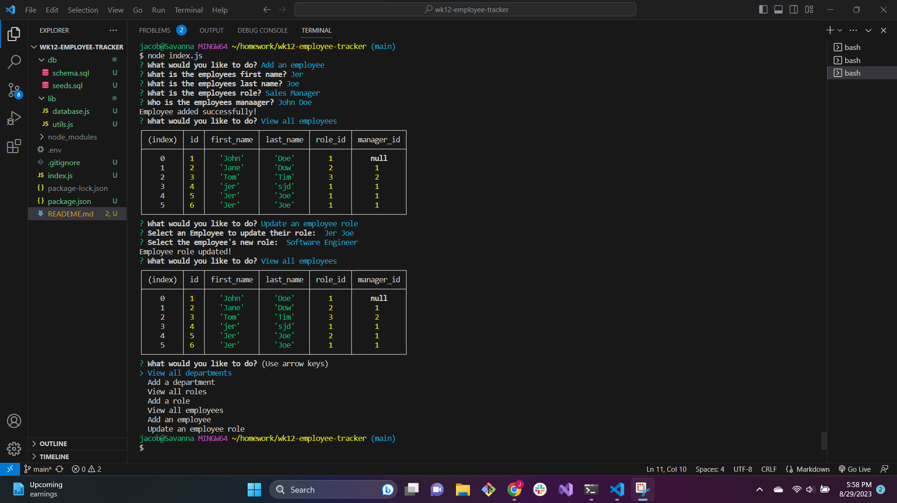

# Employee Tracker

## Description

Simple employee tracker using command line prompts and mysql and inquirer

## Usage

Run tables and seed and use node index.js to start. Tab through options given to retrieve results and follow prompts to update tables including roles, departments and employees along with updating current employee roles

Video Walkthrough (https://watch.screencastify.com/v/NGhE1xPDNTu3VhP0dOab)

